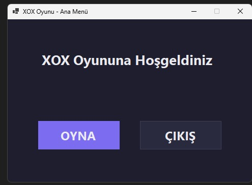
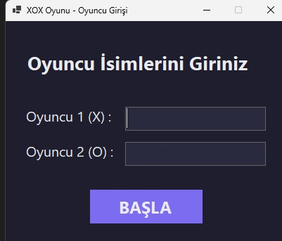
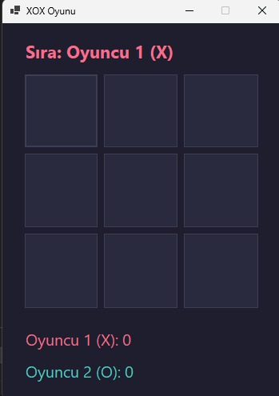

# XOX Oyunu (Tic-Tac-Toe)


İki oyunculu klasik XOX (Tic-Tac-Toe) oyunu. Windows Forms ve .NET 8 ile geliştirilmiştir.

## Özellikler

- Ana menü, oyuncu isim girişi ve oyun ekranı
- Sıra takibi ve tur bazlı skor
- Kazanan / beraberlik bildirimi (oyuncu adıyla)
- Modern koyu tema ve uyumlu renk paleti
- Katmanlı mimari: oyun mantığı UI'dan ayrılmıştır

## Gereksinimler

- Windows 10 veya üzeri
- [.NET 8 SDK](https://dotnet.microsoft.com/download/dotnet/8.0)

## Kurulum ve Çalıştırma

```bash
git clone https://github.com/KULLANICI_ADINIZ/XOX_oyunu.git
cd XOX_oyunu
dotnet build XOX_oyunu.sln
dotnet run --project XOX_oyunu/XOX_oyunu.csproj
```

## Proje Yapısı

```
XOX_oyunu/
├── XOX_oyunu.sln
├── XOX_oyunu/
│   ├── Core/           # Board, WinChecker, GameEngine
│   ├── Theme/          # AppTheme, UiStyler
│   ├── Form1.cs        # Oyun ekranı
│   ├── Form2.cs        # Ana menü
│   ├── Form3.cs        # Oyuncu girişi
│   └── Program.cs
├── docs/screenshots/   # Ekran görüntüleri (opsiyonel)
├── README.md
└── LICENSE
```

## Ekran Görüntüleri

- **Ana Menü:** 

- **Oyuncu Girişi:** 

- **Oyun Ekranı:** 

## Lisans

Bu proje [MIT](LICENSE) lisansı altındadır.

---

## English Overview

**XOX Game** is a two-player Tic-Tac-Toe desktop app for Windows, built with **C#**, **.NET 8**, and **Windows Forms**.

### Features

- Main menu, player name setup, and game board
- Turn indicator and persistent match scores
- Win/draw messages with player names
- Dark theme with a consistent color palette
- Separated game logic (`Core/`) from UI

### Requirements

- Windows 10+
- .NET 8 SDK

### Run

```bash
git clone https://github.com/YOUR_USERNAME/XOX_oyunu.git
cd XOX_oyunu
dotnet build XOX_oyunu.sln
dotnet run --project XOX_oyunu/XOX_oyunu.csproj
```

### License

MIT — see [LICENSE](LICENSE).
